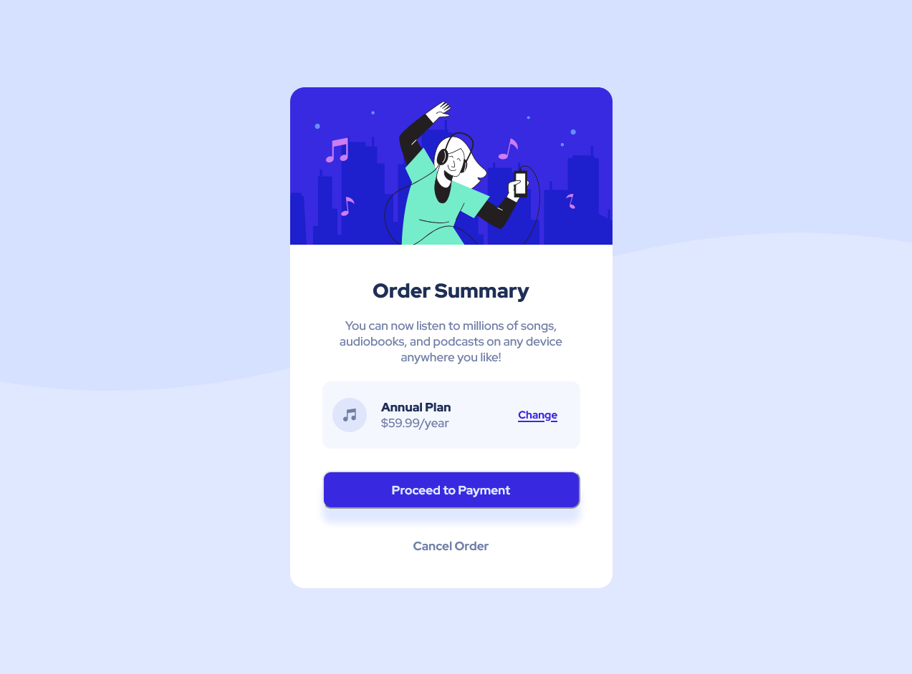

# Frontend Mentor - Order summary card solution

This is a solution to the [Order summary card challenge on Frontend Mentor](https://www.frontendmentor.io/challenges/order-summary-component-QlPmajDUj). Frontend Mentor challenges help you improve your coding skills by building realistic projects. 

## Table of contents

- [Overview](#overview)
  - [The challenge](#the-challenge)
  - [Screenshot](#screenshot)
  - [Links](#links)
- [My process](#my-process)
  - [Built with](#built-with)
  - [What I learned](#what-i-learned)
  - [Continued development](#continued-development)
  - [Useful resources](#useful-resources)
- [Author](#author)

## Overview

### The challenge

Users should be able to:

- See hover states for interactive elements

### Screenshot

### Links

- Solution URL: [https://order-summary-component-annawilczura.netlify.app/](https://order-summary-component-annawilczura.netlify.app/)

## My process

### Built with

- Semantic HTML5 markup
- CSS custom properties
- Flexbox
- SASS

### What I learned

It's my first project using SASS and also first time with media queries.

### Continued development

I tried to organize my code with SASS, but I'm sure it could be done better :D I will deepen my knowledge with future projects.

### Useful resources

- [SASS webpage](https://sass-lang.com/) - learn here how to install and use SASS.
- [SASS partials tutorial](https://www.youtube.com/watch?v=9Ld-aOKsEDk) - nice tutorial from Kevin Powell.

## Author
- Frontend Mentor - [@Anq92](https://www.frontendmentor.io/profile/Anq92)

